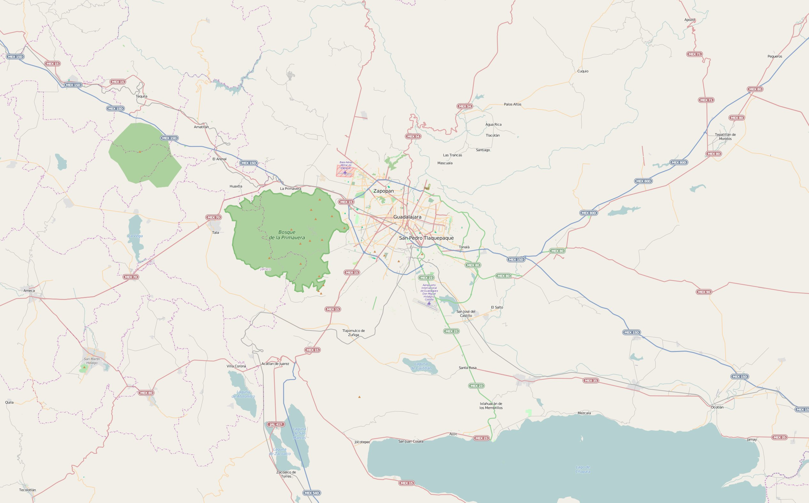
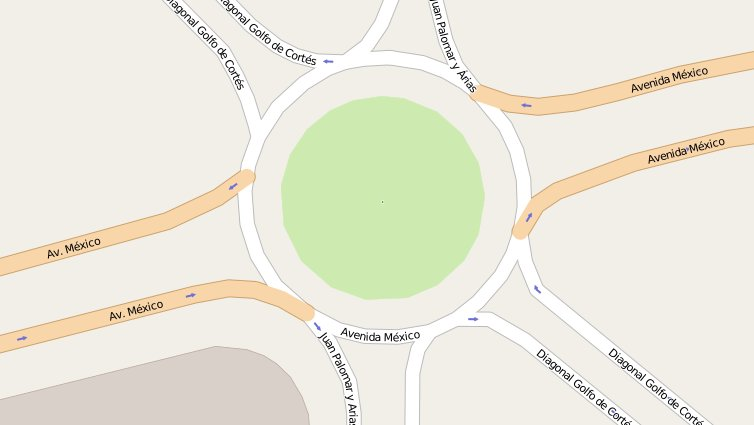
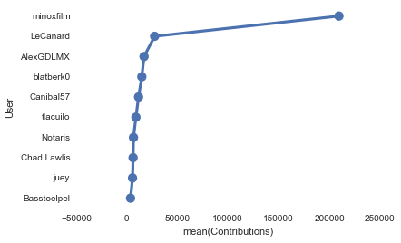
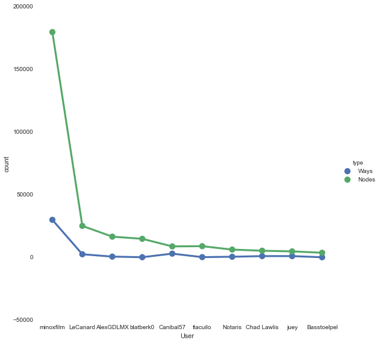
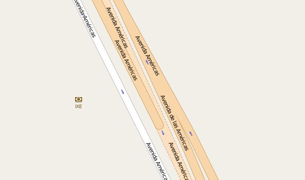
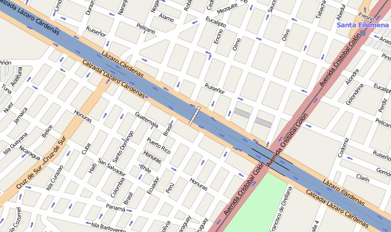
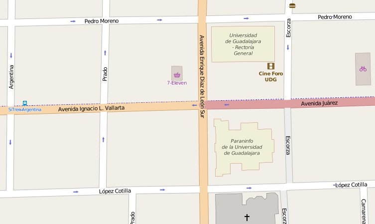

    #To include plots in the file
    %matplotlib inline

# Data Wrangling Project
## Cleaning OpenStreetMap Data

#### Map Area: Guadalajara, Jalisco, Mexico
The data was obtained via the [overpass API](http://www.overpass-api.de/query_form.html) with the following query: 

> (node(20.1797,-104.0996,21.0486,-102.6027);<;);out meta; 
>
> Which corresponds to the following area: 

###Problems encountered in your map
I performed a quick analysis over the data, where I discovered the following issues:
  * Inconsistencies due to different ways of writing acronyms and abbreviations
  * Words in all caps or all lowercase
  * Typos and misspelled words
    
#### Acronyms and Abbreviations
I found out that was very common that a same a acronyms were written in many different ways, for example, with and without dots, all caps or all lowercase, here are some real examples of this situation found in the dataset: 
  * Acronyms: 
    * S.E.P. Which is an acronym for "Secretariat of Public Education" in spanish was found as "S.E.P." and as "sep". 
    * C.U.C.E.A. which is the name of a public university, was also found as "Cucea", "cucea" and "C.U.C.E.A." 
    * I.M.S.S. is a public health institution and was found as "I.M.S.S.", and "imss".

Abbreviations had a similar problem, sometimes an abbreviation were found in lowercase, without and/or without any dot. Also, there were some scenarios, where one part of the street is named with an abbreviation, but another part is not, which isn't really an issue for people, but can be misleading to software that rely on OpenStreetMap data, such as GPS systems, here's an example of such situation:

Where the left side of the street is named "Av. Mexico" and the right side of the street is name "Avenida Mexico".

As I currently live in the explored zone, I knew some examples that I thought might be falling on these issues, however, to identify all of them, I performed an analysis with the help of a Regex expression, which helped me to Identify all the strings that contains dots in them, so I can determine if a word should be treated as an abbreviation or acronym or not. 
To fix these situations, as part of the program which reads the XML file, I created two different process, one for acronyms and one for abbreviations:

  * In the case of **acronyms**, I created a list, where I stored all the found cases in the right way they should be written, then, the program looks for the same word without dots and/or in lowercase and replace it with the word I put in the list.
  * For **abbreviations**, I used a dictionary, where the key is the full word (Or the way that I want to see expressed that word after the process), and in the value corresponding to that key, I stored all different ways of writing that word that I found during the analysis.
    
#### Capitalizing words
I found some cases where entire sentences were written completely in uppercase, or completely in lowercase.
As a way to standardize the data, I used the string function capitalize() to set the first letter of each word to uppercase and the rest of the letters as lowercase, this part of the program only applies to words that weren't detected as abbreviations or acronyms. Also, capitalize() by itself won't work if the first character of a letter isn't a letter, I added some logic to capitalize words even if those are surrounded by parentheses and exclamation marks.

The capitalization process won't affect special sentences such as websites or emails.

#### Typos and Misspellings
During the exploratory analysis of the dataset I realized that most of the inconsistencies in the data were because of misspelled words. 
To attack this problem, I categorized these errors as:

  * Typos: Words that were incorrectly spelled due to keyboard errors, such as transpositions ("Avneida" instead of "Avenida"), missing letters, and typing the wrong letter due to its proximity to the correct letter in the qwerty keyboard configuration.
  * Misspellings: Words that were wrongly spelled due to one of the following situations:
    * Letters that sound similarly in spanish, such as "s" and "z", or "b" and "v".
    * In Spanish, we use an orthographic symbol called "Acento" (Accent), which is used to differentiate words that are written the same, but sounds different when spoken and have different meaning. However, it is easy to miss an accent as is difficult to identify if a word should be accented while writing.
        
Because of this situation I added the following process:

  1. Created a dictionary with all the words in the dataset as keys, and as values for each word, how many times each word appears in the whole dataset.
    
  2. Compared each found word with each other using the edit_distance implementation of the NLTK library, any word that is less than 2 edits away from each other is treated as a possible typo.
    
  3. With this process many correct words were detected as possible typos, to rule out words that might be correct, any word that appears more than 3 times in the dataset is ignored, mainly because incorrectly typed words are less likely to appear than a correctly spelled word.
    
  4. At this point still some correct words might be still being treated as typos, to filter them out, I used a spelling corrector webservice called [After The Deadline](http://www.afterthedeadline.com/), where I sent a request with all the words that are possible typos, and the webservice responds whether the words are incorrectly spelled or not and possible corrections for each one. I ignored most of the corrections sent by this webservice and used as a filter, if the word were detected as correctly spelled word, it went discarted as a typo. The only kind of correction I used were when the a word was detected as incorrectly typed due to a missing accent.
    
  5. After The Deadline is a great webservice, but their spanish version have a problem, it doesn't recognize proper names, such as names of places and people's names and tend mark them as incorrect words. Which is a problem because most of the streets in Mexico have either the name of a relevant historical character or the name of a place, such as names of other states, cities or countries. To overcome this situation I relied on the [GeoNames webservice](http://www.geonames.org/). As the sentences found in the OpenStreetMap data at this point has been broken into words, making requests to GeoNames webservice with single words could get incorrect and hard to process results, so instead I downloaded a [GeoNames webservice dump](http://download.geonames.org/export/dump/) corresponding to Mexico, then processed and split the data into words, then used this new dataset as a cross-validation method, where a possible typo was discarded if found in the GeoNames dump.
    
  6. At this point, very few correctly spelled words made it through all the filters, and most of the possible typos identified are indeed typos. So I builded a small heuristic program which checks for the reason of the typo, such as misspellings due to similar sounding letters, missing accents, transpositions and typing errors such as hitting the wrong key. The remaining words that weren't caught by any of the predefined rules in this program are shown to the user trough the Command interface, where I chose whether if a correction for a possible typo was valid or not.
    
  7. Lastly, the identified typos are replaced in the dataset by the found corrections.
    
    
    
###Data Overview

    #File Size:
    import os
    "map.osm.......{0}Mb".format(float(os.path.getsize('map')/1048576))
    

    'map.osm.......70.0Mb'

    #Initializing the connection with mongoDB
    from pymongo import MongoClient
    client = MongoClient("mongodb://localhost:27017")
    db = client.osm
    zmg_collection = db.osm_zmg
    
    #Number of Documents
    zmg_collection.find().count()

    378700

    #Number of nodes
    zmg_collection.find({"type": "node"}).count()

    328648

    #Number of ways
    zmg_collection.find({"type": "way"}).count()

    50042

    len(zmg_collection.distinct("created.user"))

    494

    import pandas as pd
    #Top 10 contributors
    result = list( zmg_collection.aggregate([{"$group":
                                             {"_id":"$created.user", 
                                              "count":{"$sum":1}
                                             }
                                            }, 
                                            {"$sort": {"count":-1}}, 
                                            {"$limit":10}
                                           ]))
    df = pd.DataFrame.from_dict(result)
    df.columns = ["User", "Contributions"]
    import seaborn as sns
    print sns.pointplot(x='Contributions',y='User', data = df)
    df

    Axes(0.125,0.125;0.775x0.775)
    

<table border="1" class="dataframe">
  <thead>
    <tr style="text-align: right;">
      <th></th>
      <th>User</th>
      <th>Contributions</th>
    </tr>
  </thead>
  <tbody>
    <tr>
      <th>0</th>
      <td>   minoxfilm</td>
      <td> 209546</td>
    </tr>
    <tr>
      <th>1</th>
      <td>    LeCanard</td>
      <td>  27479</td>
    </tr>
    <tr>
      <th>2</th>
      <td>   AlexGDLMX</td>
      <td>  17022</td>
    </tr>
    <tr>
      <th>3</th>
      <td>   blatberk0</td>
      <td>  14823</td>
    </tr>
    <tr>
      <th>4</th>
      <td>   Canibal57</td>
      <td>  11611</td>
    </tr>
    <tr>
      <th>5</th>
      <td>    tlacuilo</td>
      <td>   9008</td>
    </tr>
    <tr>
      <th>6</th>
      <td>     Notaris</td>
      <td>   6600</td>
    </tr>
    <tr>
      <th>7</th>
      <td> Chad Lawlis</td>
      <td>   6195</td>
    </tr>
    <tr>
      <th>8</th>
      <td>        juey</td>
      <td>   5661</td>
    </tr>
    <tr>
      <th>9</th>
      <td> Basstoelpel</td>
      <td>   3680</td>
    </tr>
  </tbody>
</table>

    #Top 10 Amenities
    result = list(zmg_collection.aggregate([
                                            { "$match" :
                                                         { "amenity": {"$exists":1}
                                                         }
                                            }, 
                                            { "$group" : 
                                                         { "_id":"$amenity", 
                                                           "count" : { "$sum": 1}
                                                         }
                                            },
    
                                            {"$sort": {"count":-1}}, 
                                            {"$limit":10}
                                        ]))
    
    df = pd.DataFrame.from_dict(result)
    df.columns = ["Amenity", "Count"]
    df

<table border="1" class="dataframe">
  <thead>
    <tr style="text-align: right;">
      <th></th>
      <th>Amenity</th>
      <th>Count</th>
    </tr>
  </thead>
  <tbody>
    <tr>
      <th>0</th>
      <td>           School</td>
      <td> 159</td>
    </tr>
    <tr>
      <th>1</th>
      <td>             Fuel</td>
      <td> 154</td>
    </tr>
    <tr>
      <th>2</th>
      <td>          Parking</td>
      <td> 121</td>
    </tr>
    <tr>
      <th>3</th>
      <td>       Restaurant</td>
      <td> 119</td>
    </tr>
    <tr>
      <th>4</th>
      <td> place_of_worship</td>
      <td> 113</td>
    </tr>
    <tr>
      <th>5</th>
      <td>             Bank</td>
      <td> 106</td>
    </tr>
    <tr>
      <th>6</th>
      <td>        fast_food</td>
      <td>  86</td>
    </tr>
    <tr>
      <th>7</th>
      <td>     waste_basket</td>
      <td>  81</td>
    </tr>
    <tr>
      <th>8</th>
      <td>         Pharmacy</td>
      <td>  66</td>
    </tr>
    <tr>
      <th>9</th>
      <td>         Hospital</td>
      <td>  61</td>
    </tr>
  </tbody>
</table>

    #Most common types of street
    result = list(zmg_collection.aggregate([
                                            { "$match" :
                                                         { "highway": {"$exists":1}
                                                         }
                                            },             
                                            { "$group" : 
                                                         { "_id":"$highway", 
                                                           "count" : { "$sum": 1}
                                                         }
                                            },
                                            {"$sort": {"count":-1}}, 
                                            {"$limit":5}
                                        ]))
    
    df = pd.DataFrame.from_dict(result)
    df.columns = ["Amenity", "Count"]
    df

<table border="1" class="dataframe">
  <thead>
    <tr style="text-align: right;">
      <th></th>
      <th>Amenity</th>
      <th>Count</th>
    </tr>
  </thead>
  <tbody>
    <tr>
      <th>0</th>
      <td>   Residential</td>
      <td> 36434</td>
    </tr>
    <tr>
      <th>1</th>
      <td> living_street</td>
      <td>  3955</td>
    </tr>
    <tr>
      <th>2</th>
      <td>       Service</td>
      <td>   665</td>
    </tr>
    <tr>
      <th>3</th>
      <td>       Footway</td>
      <td>   594</td>
    </tr>
    <tr>
      <th>4</th>
      <td>     Secondary</td>
      <td>   539</td>
    </tr>
  </tbody>
</table>

    #Distribution of colaborations by type made by top 10 contributors.
    #Also shows a percentage of how much of the dataset is attributed to a given user.
    total_nodes = zmg_collection.find({"type":"node"}).count()
    total_ways = zmg_collection.find({"type":"way"}).count()
    total_documents = total_nodes + total_ways
    
    result = list(zmg_collection.aggregate([
                {
                    "$group": {
                            "_id":"$created.user",
                            "nodes" : {
                                "$sum" : {
                                    "$cond" : [{
                                        "$eq" : [
                                            "$type" , "node"
                                        ]
                                    },1,0]
                                }
                            },
                            "ways" : {
                                "$sum" : {
                                    "$cond" : [{
                                        "$eq" : [
                                            "$type" , "way"
                                        ]
                                    },1,0]
                                }
                            },                    
                            "total" : {
                                "$sum" : 1
                            }
    
                        }
                },
                {
                    "$sort" : {
                        "total" : -1
                    }
                },
                {
                    "$limit" : 10
                },
                {
                    "$project" : {
                        "ways" : 1,
                        "nodes" : 1,
                        "total" : 1,
                        "ways_per" : {"$divide" : ["$ways",total_ways] },
                        "nodes_per" : {"$divide" : ["$nodes",total_nodes] },
                        "total_per" : {"$divide" : ["$total",total_documents] }
                    }
                }
            ]
        ))
    
    #An interesting gather function to convert wide data to long data,
    #Similar to the tidyr::gather R function.
    #Obtained from http://connor-johnson.com/2014/08/28/tidyr-and-pandas-gather-and-melt/
    def gather( df, key, value, cols ):
        id_vars = [ col for col in df.columns if col not in cols ]
        id_values = cols
        var_name = key
        value_name = value
        return pd.melt( df, id_vars, id_values, var_name, value_name )
    
    
    df = pd.DataFrame.from_dict(result)
    df.nodes_per = ( df.nodes_per * 100 ).round(2)
    df.ways_per = ( df.ways_per * 100 ).round(2)
    df.total_per = ( df.total_per * 100 ).round(2)
    df.columns = ["User","Nodes", "Nodes Percentage", "Total", "Total Percentage","Ways", "Ways Percentage"]
    
    #Plot
    df_plot = df[['User','Nodes','Ways']]
    df_plot = gather(df_plot,'type','count',['Ways','Nodes'])
    print sns.factorplot(y='count',x='User',hue='type',data=df_plot, size = 8)
    #The graph shows that the users tend to do more nodes collaborations than ways collaborations, 
    #this makes sense because, according to the OSM format, a single "way" document might need more than one nodes.
    
    df = df.reindex_axis(["User","Nodes" ,"Ways","Total","Nodes Percentage","Ways Percentage","Total Percentage"], axis = 1)
    df

    <seaborn.axisgrid.FacetGrid object at 0x0000000019C116A0>
    

<table border="1" class="dataframe">
  <thead>
    <tr style="text-align: right;">
      <th></th>
      <th>User</th>
      <th>Nodes</th>
      <th>Ways</th>
      <th>Total</th>
      <th>Nodes Percentage</th>
      <th>Ways Percentage</th>
      <th>Total Percentage</th>
    </tr>
  </thead>
  <tbody>
    <tr>
      <th>0</th>
      <td>   minoxfilm</td>
      <td> 179659</td>
      <td> 29886</td>
      <td> 209546</td>
      <td> 54.67</td>
      <td> 59.72</td>
      <td> 55.33</td>
    </tr>
    <tr>
      <th>1</th>
      <td>    LeCanard</td>
      <td>  25042</td>
      <td>  2437</td>
      <td>  27479</td>
      <td>  7.62</td>
      <td>  4.87</td>
      <td>  7.26</td>
    </tr>
    <tr>
      <th>2</th>
      <td>   AlexGDLMX</td>
      <td>  16475</td>
      <td>   547</td>
      <td>  17022</td>
      <td>  5.01</td>
      <td>  1.09</td>
      <td>  4.49</td>
    </tr>
    <tr>
      <th>3</th>
      <td>   blatberk0</td>
      <td>  14745</td>
      <td>    78</td>
      <td>  14823</td>
      <td>  4.49</td>
      <td>  0.16</td>
      <td>  3.91</td>
    </tr>
    <tr>
      <th>4</th>
      <td>   Canibal57</td>
      <td>   8698</td>
      <td>  2913</td>
      <td>  11611</td>
      <td>  2.65</td>
      <td>  5.82</td>
      <td>  3.07</td>
    </tr>
    <tr>
      <th>5</th>
      <td>    tlacuilo</td>
      <td>   8867</td>
      <td>   141</td>
      <td>   9008</td>
      <td>  2.70</td>
      <td>  0.28</td>
      <td>  2.38</td>
    </tr>
    <tr>
      <th>6</th>
      <td>     Notaris</td>
      <td>   6159</td>
      <td>   441</td>
      <td>   6600</td>
      <td>  1.87</td>
      <td>  0.88</td>
      <td>  1.74</td>
    </tr>
    <tr>
      <th>7</th>
      <td> Chad Lawlis</td>
      <td>   5243</td>
      <td>   952</td>
      <td>   6195</td>
      <td>  1.60</td>
      <td>  1.90</td>
      <td>  1.64</td>
    </tr>
    <tr>
      <th>8</th>
      <td>        juey</td>
      <td>   4714</td>
      <td>   947</td>
      <td>   5661</td>
      <td>  1.43</td>
      <td>  1.89</td>
      <td>  1.49</td>
    </tr>
    <tr>
      <th>9</th>
      <td> Basstoelpel</td>
      <td>   3634</td>
      <td>    46</td>
      <td>   3680</td>
      <td>  1.11</td>
      <td>  0.09</td>
      <td>  0.97</td>
    </tr>
  </tbody>
</table>

####Aditional Ideas

There's an additional consistency problem that I didn't address as part of the project, the data contains roads that have different names at different points of the road, especially those which have multiple lanes. In the following example becomes visible that part of the Avenue is called "Avenida de las Americas" meanwhile another part of the Avenue is called "Avenida Americas"

In this other example, the road named "Lazaro Cardenas" also appears as "Calzada Lazaro Cardenas":

Most of this cases are because a street is so widely known by the population that is rare that someone uses the full street name in a day-a-day conversation. While a human would be able to understand that both names are referring to a same street, an automatic system probably won't if it is not programmed to consider this scenario.
I believe this problem can be address with a combination of Natural Language Processing and geospatial data analysis, It's important to use both text and geospatial data as it is possible that different kind of roads share the same name, for example, in spanish, we don't commonly use "Calle" (Street) as part of the street names unless the road is a special kind of road, such as Avenue, Boulevard, etc., but, as noted before with "Lazaro Cardenas", if a street is widely known the kind of road could be also omitted from the name, if a NLP program analyzes the data could interpret two different streets as the same, this can be avoided by using location data, as it's unlikely that two similarly named streets are close to each other.

Also, using only geographical data can be missleading, as there are some streets that change names at some point mainly, but not neccesarily, because to street merges. 
In the following example, the right side of the street is named "Avenida Juarez", but the left side is named "Avenida Ignacio L. Vallarta":

