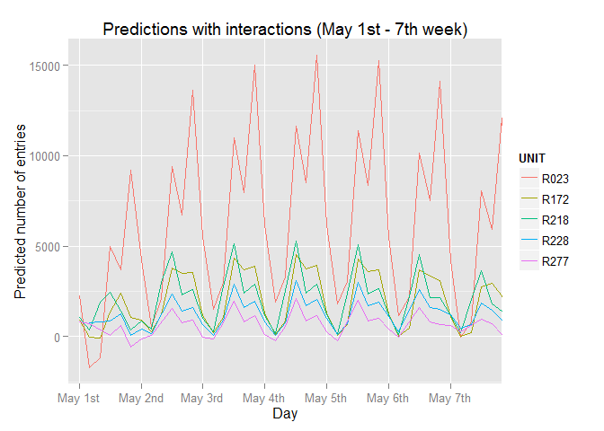

# Intro to data science project
Daniel Nava  


##Section 0. References
Here's a list of the websites that I found helpful to complete this project:

http://statsmodels.sourceforge.net/devel/example_formulas.html
http://nbviewer.ipython.org/urls/s3.amazonaws.com/datarobotblog/notebooks/multiple_regression_in_python.ipynb
http://jpktd.blogspot.mx/2012/03/numerical-accuracy-in-linear-least.html
http://blog.minitab.com/blog/adventures-in-statistics/regression-analysis-how-do-i-interpret-r-squared-and-assess-the-goodness-of-fit
http://blog.minitab.com/blog/adventures-in-statistics/multiple-regession-analysis-use-adjusted-r-squared-and-predicted-r-squared-to-include-the-correct-number-of-variables

##Section 1. Statistical Test

* **1.1 Which statistical test did you use to analyze the NYC subway data? Did you use a one-tail or a two-tail P value? What is the null hypothesis? What is your p-critical value?**

I used a two tailed Mann-Whitney U-test. 
The null hypothesis is that _there's no difference on the ridership of the New York City subway between rainy days and non-rainy days_.
I'm using a p-critical value of 0.05.


* **1.2 Why is this statistical test applicable to the dataset? In particular, consider the assumptions that the test is making about the distribution of ridership in the two samples.**

I'm using Mann-Whitney U test because the distribution of the samples of the ridership on rainy and non-rainy days have a skewed distribution. Mann-Whitney U test is a non-parametric test, which means it makes no assumptions about the underlying distribution of the tested samples.

* **1.3 What results did you get from this statistical test? These should include the following numerical values: p-values, as well as the means for each of the two samples under test.**
* Means:
    * rainy days: 2028.196
    * Non-rainy days: 1845.539

* P-value: 5.482e-06

* **1.4 What is the significance and interpretation of these results?**

The obtained p-value indicate that there are a statistically significant difference between both samples and we can reject the null Hypothesis, because the p-value (5.48*10^-6) is smaller than the alpha level selected(0.05).

##Section 2. Linear Regression

* **2.1 What approach did you use to compute the coefficients theta and produce prediction for ENTRIESn_hourly in your regression model:**
    * **OLS using Statsmodels or Scikit Learn**
    * **Gradient descent using Scikit Learn**
    * **Or something different?**
    
    I'm using Ordinary Least Squares implementation in R, **lm**.
 
* **2.2 What features (input variables) did you use in your model? Did you use any dummy variables as part of your features?**

    * UNIT as a dummy variable
    * hour (2nd degree polynomial)
    * day_week (5nd degree polynomial)
    * interaction terms
    * rain
    * tempi
    
* **2.3 Why did you select these features in your model?**

I used **UNIT** as a representation of **location**, I thought that where a station is located can significantly affect the amount of people that use that station, for example, a station near of a residential zone could be less used than a station located at the downtown or nearby some crowded places. According to the model, the use of UNIT as a dummy variable significantly improves R<sup>2</sup> which confirm that location, represented by UNIT in the model, can explain a lot of the variance in the ridership data. 

I chose UNIT over station variable because some stations can contain more than one UNIT, which might represent a problem because there are many stations where the difference of the mean ridership for the contained UNITs is very wide, for example, station **34 ST-HERALD SQ**, which contains UNITS **UNITR022 and UNITR023**, where according to their descriptive stats UNIT R022 have a higher number of entries overall:


```r
tw.station <- subset(turnstile_weather,turnstile_weather$station =='34 ST-HERALD SQ')
tw.station$UNIT <- factor(tw.station$UNIT)
with(tw.station, by(ENTRIESn_hourly, UNIT, summary))
```

```
## UNIT: R022
##    Min. 1st Qu.  Median    Mean 3rd Qu.    Max. 
##     283    1886    8654    9534   13320   32290 
## -------------------------------------------------------- 
## UNIT: R023
##    Min. 1st Qu.  Median    Mean 3rd Qu.    Max. 
##     208    1258    4892    6169    8402   18140
```

Given that using station as a dummy feature in the linear regression model will assign a coefficient for each station, I consider that it's very unlikely that using station could represent better all the variance in those entries than using UNITs as a dummy feature, where each UNIT will get a coefficient.

I used **day_week** and **hour** to represent **time** in my model. I thought that is very unlikely that the ridership behaves the same way from 6:00am to 9:00am, when people have some scheduled responsibilities, such as going to work or kids going to school, than at 12:00am, when there's no particular subset of people who might share a common need for transportation. Also, I consider that ridership might differ in between days, especially between weekdays and weekends.


As I mentioned before, I included them as **polynomial terms**, that's because the relationship of this variables to the number of entries **is not linear**, I don't expect the ridership to increase as hour or the day of the week increases. I expect it to fluctuate, to increase and decrease over the course of the week:

 

The plot shows the non-linear relationship I referred to, and how it affects 5 different UNITS. As we can see, an increase in the hour and day variable does not necessarily relate to an increase on the number of entries.

**Interaction terms**

At this point, the model will create a generalization of the effect of day and hour features over ridership of all UNITs, without getting specific to any UNIT, and the dummy features from UNIT will only change the slope up and down, which will drag up and down the pattern created by day and hour features and their respective polynomial terms. As a descriptive model, this could be great, but as a predictive model I think it will fall short a lot of times, I think this is because the size of the effect of the features will tend to vary from UNIT to UNIT. 

There are UNITS where, ignoring abnormal outliers, the difference between the lowest and the highest number of entries is very large or very small, sometimes this difference is in tens of thousands and some others times the differences is barely hundreds of entries, and given that the difference between the lowest and the highest value of the pattern created by the model will be constant and just dragged higher or lower by categorical features, the variance explained by this pattern won't be enough to make relatively accurate predictions:


```r
#Creating model without interactions
model_without_interactions <- lm(ENTRIESn_hourly ~ UNIT + poly(day_week,2) + poly(hour,5), data = turnstile_weather) 
turnstile_weather$predictions <- fitted(model_without_interactions)
```
  

*Same UNITS were used for both plots. 
The first plot shows the pattern that I was writing about in the last paragraph and how it gets moved up and down depending on the UNIT variable, and the second plot shows the actual values for that same UNITs.

If we take a closer look to UNIT R023, we'll see that the pattern drawn by observations are wider that the pattern drawn by the predictions.


To fix this, I used **"interaction terms"**, multiplying all of the current features in the model with each other, as a way to include in the model the effect of the relationship of two variables over the dependent variable:


```r
#Creating model with interactions
model_with_interactions <- lm(ENTRIESn_hourly  ~ UNIT + UNIT:poly(day_week,2) + UNIT:poly(hour,5) + poly(day_week,2) + poly(hour,5) + poly(hour,5):poly(day_week,2), data = turnstile_weather) 
turnstile_weather$predictions <- fitted(model_with_interactions)
```
 

The interaction terms I used as features are:
* UNIT and hour
* UNIT and day_week
* day_week and hour
Including all the polynomial terms of hour and day_week.
This will create a lot more of features, but, as shown by the previous plot, will also adjust better the predictions to the actual values.

At this point now I was worried about over fitting the model, with the interaction features I was adding more than 1500 new features, so I started using a cross-validation technique, I divided the set into training and testing sets, using 90% of the data for training and 10% for testing. Then, I created the model over the training set, and started to measure R<sup>2</sup> obtained by the testing dataset. If the difference between R<sup>2</sup> on training and testing decreases as I include more features I will know that the model actually improved its prediction power, but if the difference increases, that would mean that the predicting power of the model is decreasing and has started to model the random noise in the data. 

To avoid just getting better for a specific scenario, I tried with 3 different random seeds when splitting the dataset and I check that in none of them this difference was increasing.

**Weather features**
So far, according to the R<sup>2</sup> about 86% percent of variance in the data is being explained by the model, but, without any weather variable yet, and with only 14% variance left to explain, considering that part of that variance is just an unexplained random error, I can expect a very low impact of any weather variable on the goodness of fit, which made it harder for me to find correlations and model weather variables.

I included **rain** and **tempi** because, by intuition, I would expect some correlation between ridership and weather, for example, I would expect more people take the subway whenever its raining to avoid rain, or to avoid using the subway whenever its too hot. But that might depend on the day, for example, if it starts raining on weekend, when people tend to go out for recreational purposes, I would expect less people to take the subway because some people would refrain to go out if it is raining (or if it's about to rain), but if it's raining at 8:00 a.m. in a weekday, I would expect more people to take the subway, because even if it's raining, most of the people still will have to go to work and I find very likely that more people than habitual will take the subway just to avoid rain. So I also included interaction features between rain, tempi and the weekday indicator feature.

According to my experience with hour and day features, the effect of a feature over ridership might differ greatly between UNITs, so it's very likely that the interactions between weather and UNIT features are also relevant, meaning that there can be really weather-sensitive UNITs and some others practically unaffected, but when I tried adding a feature considering a weather variable for each UNIT, the model started to over fit (according to the cross validation technique I was using), so I didn't created any interaction terms between UNIT and rain or tempi features.


* **2.4 What are the parameters (also known as "coefficients" or "weights") of the non-dummy features in your linear regression model?**

This are the coefficients of my model, excluding all the features related to UNIT.

```
##                              Feature   Coefficient
## 1                        (Intercept)  3.598865e+02
## 2                 poly(day_week, 2)1 -5.749824e+03
## 3                 poly(day_week, 2)2 -8.489420e+03
## 4                     poly(hour, 5)1  1.825230e+04
## 5                     poly(hour, 5)2  2.771994e+04
## 6                     poly(hour, 5)3 -1.953643e+04
## 7                     poly(hour, 5)4  7.227157e+04
## 8                     poly(hour, 5)5  3.934022e+04
## 9                               rain -6.251991e+02
## 10                             tempi -2.224258e+00
## 11 poly(day_week, 2)1:poly(hour, 5)1 -1.569726e+06
## 12 poly(day_week, 2)2:poly(hour, 5)1 -1.286320e+06
## 13 poly(day_week, 2)1:poly(hour, 5)2 -1.702879e+06
## 14 poly(day_week, 2)2:poly(hour, 5)2 -2.416750e+06
## 15 poly(day_week, 2)1:poly(hour, 5)3 -1.463026e+06
## 16 poly(day_week, 2)2:poly(hour, 5)3  3.434646e+06
## 17 poly(day_week, 2)1:poly(hour, 5)4 -3.375525e+06
## 18 poly(day_week, 2)2:poly(hour, 5)4 -3.180554e+06
## 19 poly(day_week, 2)1:poly(hour, 5)5  6.877734e+05
## 20 poly(day_week, 2)2:poly(hour, 5)5 -3.410610e+06
## 21            poly(hour, 5)1:weekday  1.431080e+05
## 22            poly(hour, 5)2:weekday -5.693641e+04
## 23            poly(hour, 5)3:weekday -1.297916e+04
## 24            poly(hour, 5)4:weekday  4.453877e+04
## 25            poly(hour, 5)5:weekday  5.622740e+04
## 26               poly(hour, 5)1:rain -1.199470e+04
## 27               poly(hour, 5)2:rain  8.480591e+03
## 28               poly(hour, 5)3:rain  8.757911e+03
## 29               poly(hour, 5)4:rain  4.645161e+01
## 30               poly(hour, 5)5:rain -5.025084e+03
## 31                      weekday:rain -7.084615e+01
## 32              poly(hour, 5)1:tempi -1.590659e+03
## 33              poly(hour, 5)2:tempi -2.147493e+02
## 34              poly(hour, 5)3:tempi  1.584233e+02
## 35              poly(hour, 5)4:tempi -1.368883e+03
## 36              poly(hour, 5)5:tempi -1.026817e+03
## 37                     weekday:tempi -1.498018e+01
## 38                        rain:tempi  9.925564e+00
```


* **2.5 What is your model's R2 (coefficients of determination) value?**

R<sup>2</sup> whole dataset: 0.8683

R<sup>2</sup> training dataset: 0.87

R<sup>2</sup> testing dataset: 0.8467


* **2.6 What does this R2 value mean for the goodness of fit for your regression model? Do you think this linear model to predict ridership is appropriate for this dataset, given this R2  value?**

R<sup>2</sup> is an indicator of how much of the variance in the data is being explain by the model, being 0 the lowest value, meaning nothing it's being explained and 1 the highest possible value which would mean that everything in the data has being modeled, in a real scenario, this would also mean that the expected random noise in the data has been also modeled and most likely the model will have very low, if any, predictive power. 

The obtained R<sup>2</sup> means that the model can explain about 87% of the data, while the R<sup>2</sup> over the testing dataset means that while the model have a good score as a descriptive model, also have a strong predictive power, because it was able to predict about 85% of the variance of previously unseen data points.

##Section 3. Visualization


* **3.1 One visualization should contain two histograms: one of  ENTRIESn_hourly for rainy days and one of ENTRIESn_hourly for non-rainy days.
You can combine the two histograms in a single plot or you can use two separate plots.
If you decide to use to two separate plots for the two histograms, please ensure that the x-axis limits for both of the plots are identical. It is much easier to compare the two in that case.
For the histograms, you should have intervals representing the volume of ridership (value of ENTRIESn_hourly) on the x-axis and the frequency of occurrence on the y-axis. For example, each interval (along the x-axis), the height of the bar for this interval will represent the number of records (rows in our data) that have ENTRIESn_hourly that falls in this interval.
Remember to increase the number of bins in the histogram (by having larger number of bars). The default bin width is not sufficient to capture the variability in the two samples.**

 


* **3.2 One visualization can be more free form. You should feel free to implement something that we discussed in class (e.g., scatter plots, line plots) or attempt to implement something more advanced if you'd like. Some suggestions are:
Ridership by time-of-day
Ridership by day-of-week**


 


## Section 4. Conclusion

Please address the following questions in detail. Your answers should be 1-2 paragraphs long.
* **4.1 From your analysis and interpretation of the data, do more people ride
the NYC subway when it is raining or when it is not raining?**

According to the performed statistical test, more people tend to ride the NYC when it's raining.

* 4.2 **What analyses lead you to this conclusion? You should use results from both your statistical tests and your linear regression to support your analysis.**

With the p-value obtained from Mann-Whitney U-test, I was able to determinate that there was a statistically significant difference between the ridership on rainy and non-rainy days, which mean it's very unlikely that the difference is due to chance. 

Now that I know that there's a difference, to determine which sample have a greater ridership, I performed some descriptive statistics:


```r
with(turnstile_weather, by(ENTRIESn_hourly, rain, summary))
```

```
## rain: 0
##    Min. 1st Qu.  Median    Mean 3rd Qu.    Max. 
##       0     269     893    1846    2197   32810 
## -------------------------------------------------------- 
## rain: 1
##    Min. 1st Qu.  Median    Mean 3rd Qu.    Max. 
##       0     295     939    2028    2424   32290
```

According to the means, I was able to conclude that the ridership when it's raining tend to be higher that when it's not raining.


## Section 5. Reflection

Please address the following questions in detail. Your answers should be 1-2 paragraphs long.
* **5.1 Please discuss potential shortcomings of the methods of your analysis, including:
Dataset,
Analysis, such as the linear regression model or statistical test.**

I think the fact that the dataset comes only from May, 2011 introduces some bias to the linear regression model, because I think it's unlikely that the ridership will behave the same way across the year.

There are two UNITs that have an unusual pattern across the month, R459 and R464, one of them is never used in the whole dataset, and the other one was active only for a few days, I think this two UNITs could be considered outliers. 

Also, there are some data points where the number of entries drastically drops, compared to the rest of the data points, I'm guessing that could be because the station closes due to some maintenance, I think this cases might also be acting as outliers.

There's very little information about some weather variables, specially fog, which, I think, makes it harder to correlate them to the ridership.

About the linear regression model, an issue is that OLS can be very computational intense, sometimes it took up to 15 minutes to fit the model, in that sense, Gradient descent could be a better idea. 

Linear regression can be very sensitive to outliers, because the estimator will l try to minimize the Mean Square Error, this means that the difference between the outliers and the predictions will be minimized by the estimator, pulling the slope of the model towards the outliers and against the observations.

Regarding the model itself,  the number of features that I included in the model might be a potential shortcoming, having 2190 features (Including dummy variables) makes the model harder to understand and interpret, and probably, despite of the applied cross-validation technique might have started to overfit.

Also, I feel that using a 5th degree polynomial for the hour feature can be a shortcoming because high degree polynomials are more likely to overfit, but I kept them it because according to the F-test in the summary of the model, all of the polynomial terms for feature hour are relevant to the model with a very low probability of being due to chance and using them actually improved R<sup>2</sup> coefficient.
